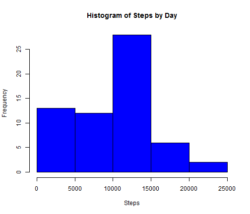
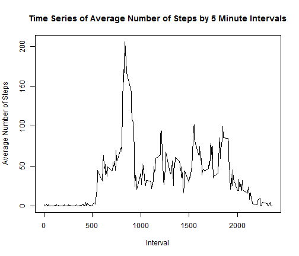
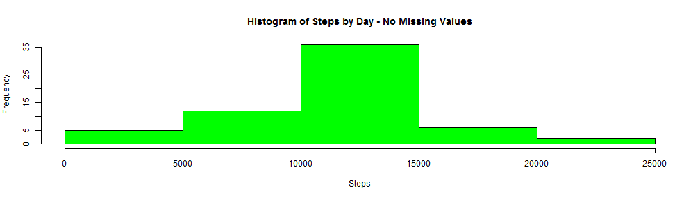
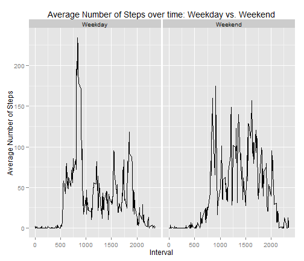

# Reproducible Research : Peer Assessment 1

In this assignment, we were given a dataset consisting of the number of steps taken by an individual over the course of two months in five minute intervals and asked to answer a few specific questions using plots and calculations in R.

## Loading and preprocessing the data

We need to clean and create versions of the data so that it can be used to answer each question.

```r
setwd("C:/Users/Preston/Desktop/Coursera/Reproducible Research")
data <- read.csv("Data/activity.csv", header=T)

## Convert date variable to a date field
data$date <- as.Date(data$date)

## Steps by Day
library(plyr)
daily.data <- ddply(data,"date",function(x) sum(x$steps, na.rm=T))
names(daily.data)[2] <- "steps"

## Steps by time interval
interval.data <- ddply(data,"interval",function(x) mean(x$steps, na.rm=T))
names(interval.data)[2] <- "steps"
```

## What is mean total number of steps taken per day?

We were asked to start by making a histogram of the total number of steps taken by day.

```r
hist(daily.data$steps, xlab="Steps", main="Histogram of Steps by Day", col="blue")
```

 

Next, we needed to calculate the mean and median total number of steps taken per day.


```r
mean(daily.data$steps)
```

```
## [1] 9354
```

```r
median(daily.data$steps)
```

```
## [1] 10395
```

## What is the average daily activity pattern?

Now let's look at the average number of steps taken for each of the 5 minute intervals and create a time series plot.


```r
with(interval.data,
     plot(interval, steps, type="l", xlab="Interval", ylab="Average Number of Steps", 
          main="Time Series of Average Number of Steps by 5 Minute Intervals")
     )
```

 

Find the interval that has the highest average number of steps in the dataset.

```r
interval.data$interval[interval.data$steps == max(interval.data$steps)]
```

```
## [1] 835
```

## Imputing missing values

The number of steps is missing for many of the day/intervals. This section looks at the NA's and attempts to account for them.

We will start by counting the number of NA's in the dataset.


```r
sum(is.na(data$steps))
```

```
## [1] 2304
```

Let's fill in the missing dataset using the average number of steps taken for each interval as calculated in the previous section. The code below implements this solution.


```r
## start by creating a copy
data.2 <- data
    
## go one row at a time, 
## if steps in the given row is missing, replace with the number from interval.data
for (i in 1:nrow(data.2)) {
    if (is.na(data.2$steps[i])) {
        data.2$steps[i] <- interval.data[data.2$interval[i]==interval.data$interval, 2]
    }
}
```

Now we can recreate the histogram for the total number of steps taken each day...


```r
## recreate the daily dataset first
daily.data.2 <- ddply(data.2,"date",function(x) sum(x$steps, na.rm=T))
names(daily.data.2)[2] <- "steps"

hist(daily.data.2$steps, xlab="Steps", main="Histogram of Steps by Day - No Missing Values", 
     col="green")
```

 

... and recalculate the mean and median.

```r
mean(daily.data.2$steps)
```

```
## [1] 10766
```

```r
median(daily.data.2$steps)
```

```
## [1] 10766
```

Replacing those missing values with the average by the interval has changed our results. The histogram has become more bell shaped as the excess in the left tail has now been spread out to the higher number of steps and the mean and median have both increased. 

The overall impact of imputing missing values is that the estimates of the total daily number of steps has increased. This makes sense as all of those NA's were essentially treated as 0's in the original sums. 

## Are there differences in activity patterns between weekdays and weekends?

For this section, we need to start by creating a new variable that will indicate if a given day is during the week or the weekend. Since we will be looking at averages for each of the five minute intervals, as opposed to sums where having missing data causes a more substantial problem, we will go back to the original dataset.


```r
## initialize the new variable as "Weekday"
data$type <- "Weekday"

## replace with "Weekend" if it's a Saturday or Sunday
for (i in 1:nrow(data)) {
    if (weekdays(data$date[i]) == "Saturday" | weekdays(data$date[i]) == "Sunday") {
        data$type[i] <- "Weekend"
    }
}
```

Now we can get the five minute interval averages by weekend and weekday...


```r
interval.type.data <- ddply(data,.(interval,type),function(x) mean(x$steps, na.rm=T))
names(interval.type.data)[3] <- "steps"
```

... and make our time series plots.


```r
## http://docs.ggplot2.org/current/index.html is a great ggplot reference
library(ggplot2)
ggplot(interval.type.data, aes(interval, steps)) + geom_line() + facet_wrap(~ type, nrow=1) +
    ggtitle("Average Number of Steps over time: Weekday vs. Weekend") + 
    xlab("Interval") + ylab("Average Number of Steps")
```

 

There seem to be more steps taken early on during weekdays, but the person took many more steps, on average, during weekend afternoons as opposed to weekday afternoons.
